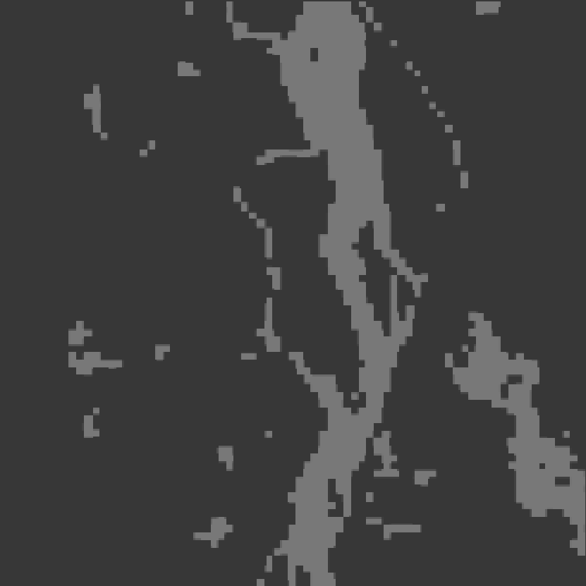
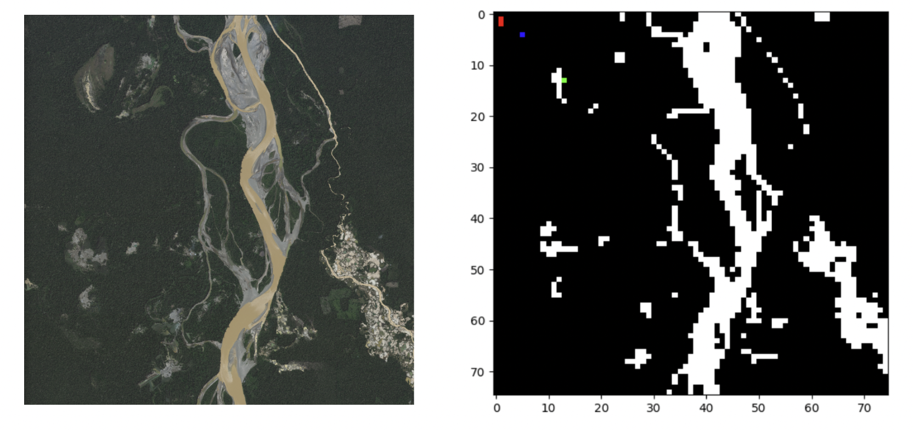

# Forest Fire Rescue Reinforcement Learning Project
## Overview

This project aims to demonstrate the use of reinforcement learning (RL) in the context of wilderness fire rescue missions. We simulate a scenario where a drone is deployed to locate and rescue a person in a wildfire-affected area. The goal is to navigate the drone to the person's location as quickly as possible, while avoiding the fire. To do this, we used a standard [Q-learning algorithm](Q_Learning.ipynb) and later a Deep Q-Network (DQN) agent in the three notebooks: [baseline algorithm](Starting_Point_DQN.ipynb), [exploration and exploitation](Exploration_Exploitation_DQN-2.ipynb) method, an extra criteria for [revising states](Reward_Revisiting_States_DQN.ipynb) and the [learning rate scheduler](Learning_Rate_Optimization.ipynb).

## Prerequisites
The project is also designed to be used on GoogleColab. To successfully run the code, follow these steps:

* Google Colab: Make sure you have access to Google Colab. You can access it here. You will need a Google account to use Colab.

* Image File: Obtain the necessary image file (details provided in the project documentation or directly in the code). Save this image to your Google Drive in a location you can easily access.

* Mounting Google Drive: In order to access the image from your Google Drive, you will need to mount your drive in the Colab notebook.

## Environment

The environment for this project is defined in the ForestFireEnvironment class in forest_fire_environment.py. This class is a custom PyEnvironment from the TensorFlow Agents library. It represents a grid-like area where each grid cell can be either empty, contain the drone, the person to be rescued, or be on fire. The drone can move in four directions (up, down, left, right). The fire spreads randomly but not instantaneously, simulating the dynamics of a real fire. The environment is partially observable, meaning that the agent (drone) only knows the state of the grid cells it has visited.

In the environment, the agent's actions are represented as integers in the range [0, 3], corresponding to the four possible directions of movement. Observations are represented as flattened versions of the grid, with extra elements indicating the positions of the drone and the person and the rewards are given based on the agent's actions: -1 for each step taken, -100 for entering a fire cell, and +100 for reaching the person.

## Agent 
The agent for this project is a DQN, defined in dqn_agent.py. It uses a Q-Network to estimate the Q-values of state-action pairs. The network takes as input the state of the environment and outputs a Q-value for each possible action. The agent's policy is to select the action with the highest Q-value.

The DQN agent is trained using experience replay and target network techniques to stabilize the learning process. It interacts with the environment to collect experience (state, action, reward, next state) tuples, which are stored in a replay buffer. During training, batches of experiences are sampled from the buffer and used to update the Q-Network.

The learning process is controlled by several hyperparameters, such as the learning rate and the exploration/exploitation trade-off. These are optimized across three different notebooks for different starting locations, learning rates, and exploration/exploitation balances.

## Animation 
The AnimationWrapper class, defined in animation_wrapper.py, is used to visualize the path taken by the drone through the environment. After the agent has been trained and a path has been generated, the AnimationWrapper class can be used to generate an animation of the path. The generated animation is a sequence of frames, each representing the state of the environment at a specific time step.

The Baseline Model

Learning Rate Training

Exploration/ Exploitation

## Additional Information
This project also includes images uploaded in the environment, which provide visual representations of the different states of the grid cells (empty, drone, person, fire). These images are used in the AnimationWrapper class to generate a more visually appealing and interpretable animation of the drone's path.

